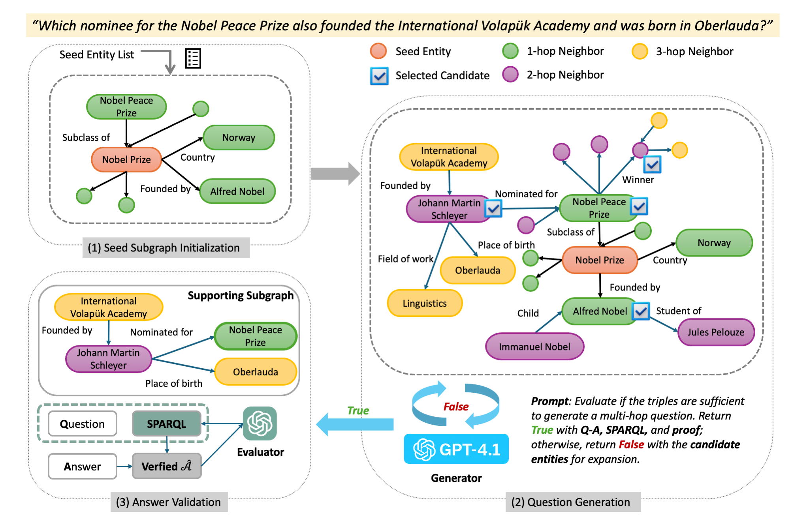

# ✨ KGQAGen: Diagnosing and Addressing Pitfalls in KG-RAG Datasets, toward More Reliable Benchmarking

This is official version of KGQAGen framework. It interactively generates challenging KGQA instances from seed Wikidata entities using an LLM agent and SPARQL querying. Our `KGQAGen-10k` example dataset is available in [https://huggingface.co/datasets/lianglz/KGQAGen-10k](https://huggingface.co/datasets/lianglz/KGQAGen-10k).

---


## ⚙️ Requirements

Create a `.env` file in the project root:
```
OPENAI_API_KEY=your_api_key_here
```

Create your environment:
```
conda create -n KGQAGen
conda activate KGQAGen
pip install -r requirement.txt
```
---

## Prepare: Get Wiki Vital Articles Level 5 as Seed

KGQAGen supports light version using the Wikidata Query Service (WDQS) to execute SPARQL queries over the public Wikidata knowledge graph. This service provides real-time access to structured facts from Wikidata and supports complex graph traversal, filtering, and reasoning.


From the project root directory, run:

```bash
python src/main/wikivital5.py
```

This script performs the following:

- Queries the category tree under **"Wikipedia level-5 vital articles"**
- Retrieves subcategories and article titles
- Resolves each article to its corresponding **Wikidata QID** using the Wikipedia API
- Saves the result as a CSV file under `data/raw/seed.csv`

### 🔍 Sample Output (`seed.csv`)

| title                       | qid       | url                                                  |
|----------------------------|-----------|-------------------------------------------------------|
| 12 Angry Men (1957 film)   | Q2345     | https://en.wikipedia.org/wiki/12_Angry_Men_(1957_film) |
| 1812 Overture              | Q212776   | https://en.wikipedia.org/wiki/1812_Overture           |
| 24 (TV series)             | Q56194    | https://en.wikipedia.org/wiki/24_(TV_series)          |

---

## STEP 1: Generate the dataset by LLM-Guided on KG

Once the `seed.csv` is generated, you can use it to drive subgraph retrieval and question generation for KGQA.

```bash
python src/main/generator.py
```

This will:

1. Load the seed entity list from `data/processed/seed.csv`
2. Use the OpenAI API to generate natural questions with answers and reasoning
3. Query Wikidata via the default SPARQL endpoint (online or local)
4. Save results to `data/processed/gen_data.json`

---

## 💾 Output Format (Line-by-Line JSON)

File: `data/processed/gen_data.json`

Each line is a complete QA instance with full SPARQL and reasoning trace:

```json
{
  "id": 1,
  "seed": "Q74957",
  "question": "Which administrative territorial entity contained within Anshan shares a border with a city other than Anshan?",
  "answer": ["Haicheng (Q1011073)"],
  "sparql": "SELECT ?entityLabel WHERE { wd:Q74957 wdt:P150 ?entity . ?otherCity wdt:P47 ?entity . FILTER(?otherCity != wd:Q74957) . SERVICE wikibase:label { bd:serviceParam wikibase:language \"en\" . } }",
  "proof": [
    ["Anshan (Q74957)", "contains the administrative territorial entity (P150)", "Haicheng (Q1011073)"],
    ["Jinzhou (Q28996)", "shares border with (P47)", "Anshan (Q74957)"]
  ]
}
```

## STEP 2: Run the Evaluator

```bash
python src/main/evaluator.py
```

The script performs:
1. SPARQL query execution (via online or local endpoint)
2. Answer comparison with expected values
3. Filtering of inconsistent or invalid results
4. Saving verified outputs to `data/processed/data.jsonl`

---

## 📤 Output

The verified QA pairs are written to:

```
data/processed/data.jsonl
```

Each line is a JSON object, for example:

```json
{
  "id": 7067,
  "seed": "Q210636",
  "question": "Which capital city serves both as the administrative center of Príncipe and is located within an entity that is itself located in the Príncipe Autonomous Region?",
  "answer": ["Santo António"],
  "sparql": "SELECT ?capitalLabel WHERE { wd:Q210636 wdt:P36 ?capital . wd:Q210636 wdt:P131 wd:Q2366966 . SERVICE wikibase:label { bd:serviceParam wikibase:language \"en\" . } }",
  "proof": [
    ["Príncipe (Q210636)", "capital (P36)", "Santo António (Q973656)"],
    ["Príncipe (Q210636)", "located in the administrative territorial entity (P131)", "Príncipe Autonomous Region (Q2366966)"]
  ]
}
```

---

## 🌐 SPARQL Endpoint Configuration

By default, an **online Wikidata endpoint**, [query.wikidata.org](https://query.wikidata.org/) is used to run SPARQL. To switch between endpoints:

```python
ENDPOINT = "https://query.wikidata.org/sparql"  # Public
# ENDPOINT = "http://localhost:8890/sparql"     # Local Virtuoso
```

For large-scale runs, consider using a locally hosted SPARQL endpoint via Virtuoso. Refer to `virtuoso/README.md` if you need help setting up the local SPARQL server.

---

## Baseline KG-RAG Models

- Check src/baseline/README.md for running and deploy guidance.

## ✅ Tips

- Make sure your endpoint is up and responding before evaluation
- Filter or log failed queries for debugging
- Parallelize execution if evaluating large batches
